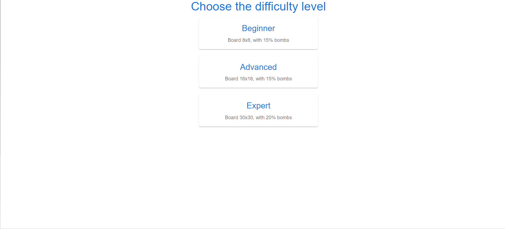
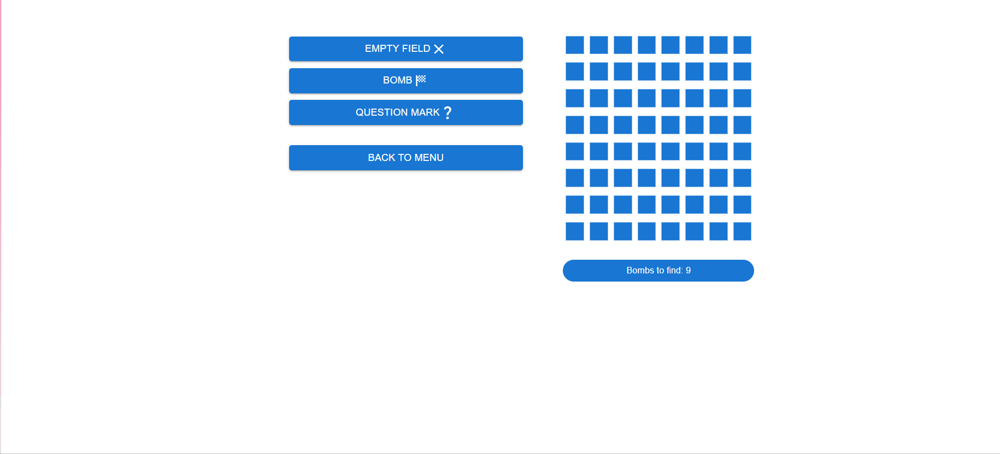

# MINESWEEPER

## SPIS TREŚCI

- [URUCHOMIENIE PROJEKTU](#uruchomienie-projektu)
- [UŻYTE TECHNOLOGIE / BIBLIOTEKI](#użyte-technologie-/-biblioteki)
- [FUNKCJONALNOŚCI](#funkcjonalności)
- [STATUS PROJEKTU](#status-projektu)
- [ZRZUTY EKRANU](#zrzuty-ekranu)

## URUCHOMIENIE PROJEKTU

Aby uruchomić projekt należy wejść w folder projektu i wpisać poniższe polecenie, w celu zainstalowania zależności

```
yarn install
```

lub

```
npm i
```

Po zainstalowaniu zależności wystarczy już wpisać

```
yarn start
```

lub

```
npm start
```

## UŻYTE TECHNOLOGIE / BLIBLOTEKI

- lodash
- radium
- react (17.0.2)
- react-animations
- react-confetti
- react-icons
- react-router-dom
- react-use
- material UI

## FUNKCJONALNOŚCI

- Użytkownik ma do wyboru 3 plansze, każda o innym poziomie trudności
- Użytkownik może oznaczyć pole pod którym znajduje się bomba znacznikiem flagi
- Użytkownik może zaznaczyć pole nad którym się zastanawia znakiem zapytania
- Użytkownik może odsłaniać pola, jeśli kliknie puste pole, które sąsiaduje z innym pustym to plansza odsłoni się rekurencyjnie
- Na polach znajdują się cyfry, które pokazują ile bomb znajduje się na sąsiednich polach
- Jeśli użytkownik prawidłowo oznaczy wszystkie bomby wygrywa, natomiast jeśli odsłoni bombę przegrywa
- W momencie wygrania pojawia się animacja konfetti
- Plansza pojawia się używając animacji

## STATUS PROJEKTU

Projekt został zakończony (04.03.2022)

## ZRZUTY EKRANU





